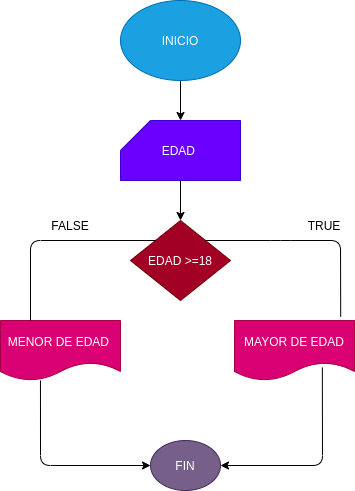

## EJERCICIO 1 ESTRUCTURAS CONDICIONALES 

## Programa para verificar si usted es mayor de edad 

## ANALISIS

### Definición de variables

edad: edad de la persona
Si la persona tiene 

## Diseño 

